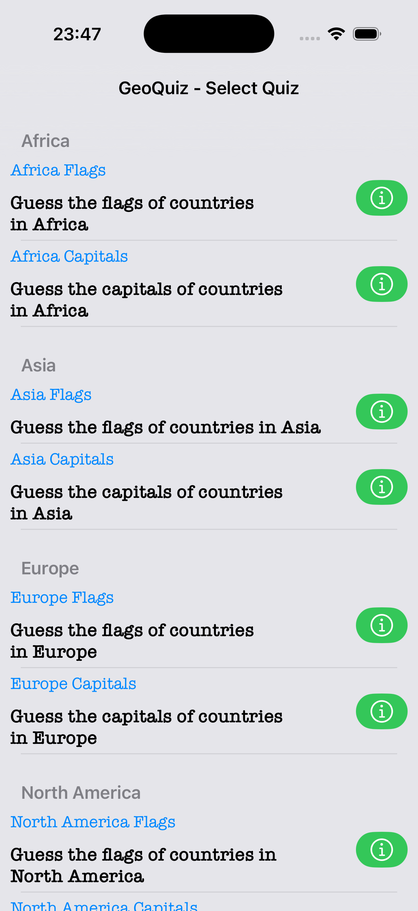
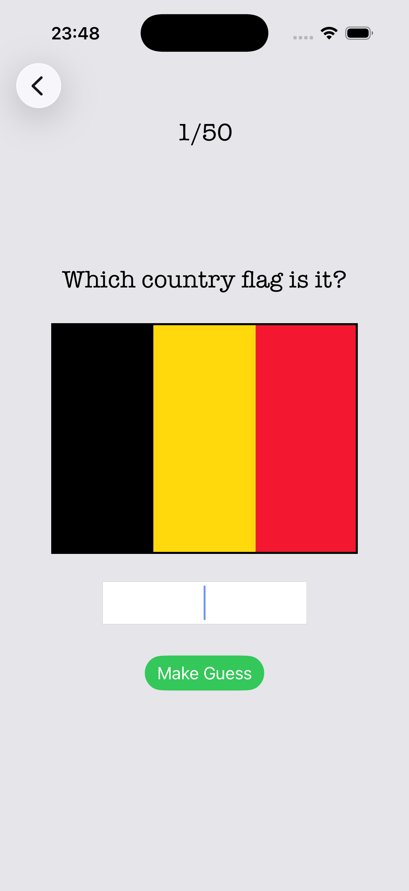
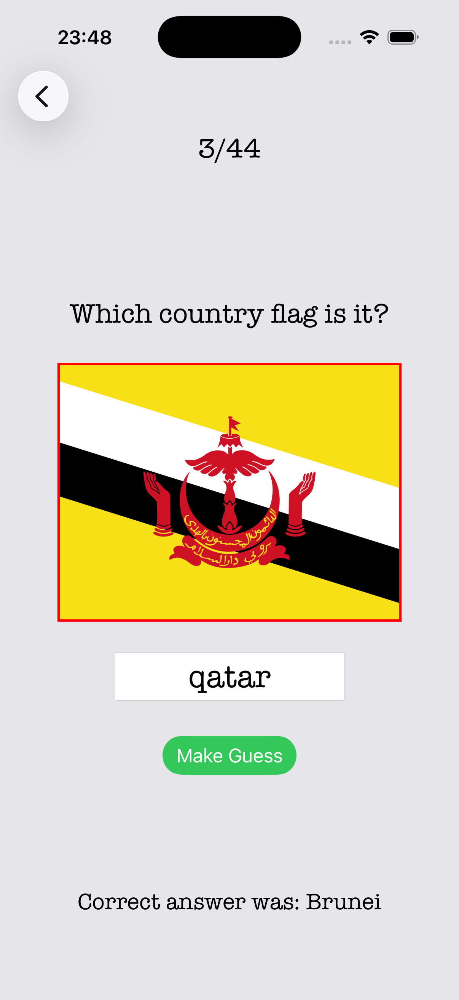
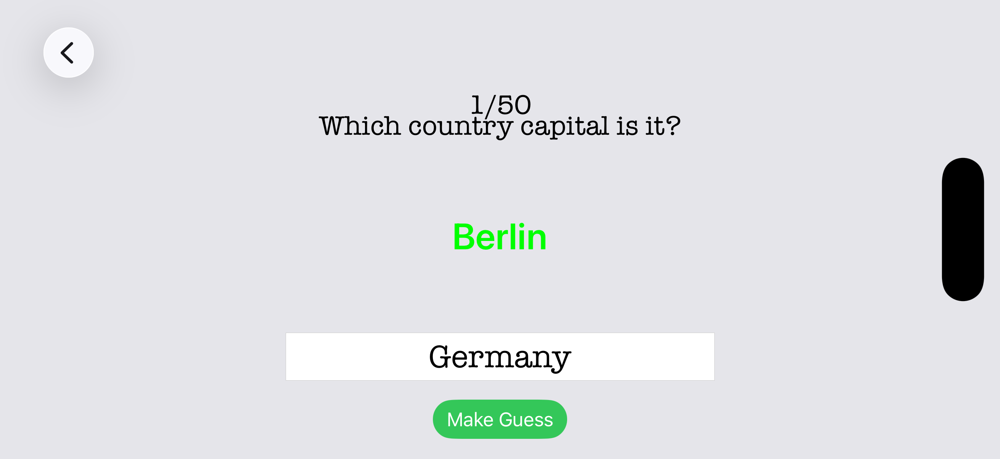
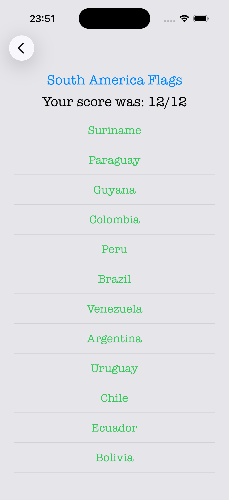
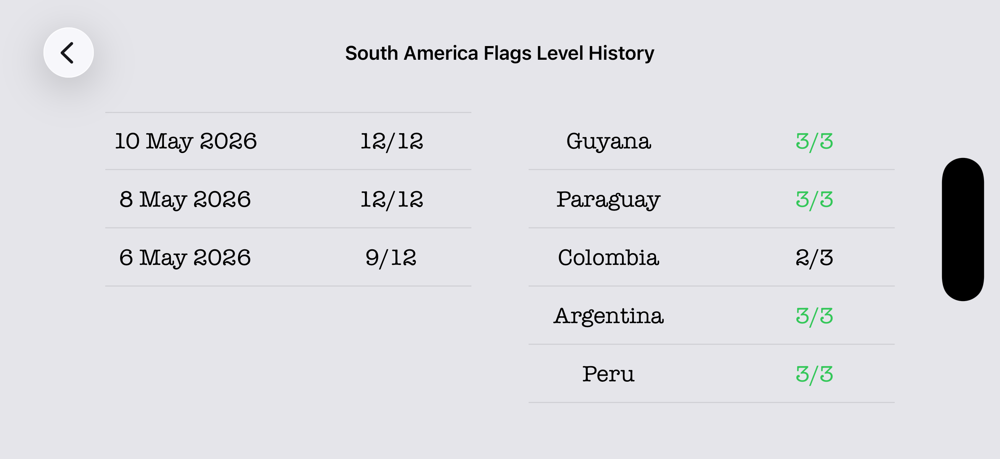

Geography quiz application for iOS built in Swift using UIKit and CoreData.

TECHNOLIGIES
- Swift
- XCode
- UIKit
- CoreData

FEATURES

- Country flags and capitals quizzes
- Score saving with CoreData
- History tracking for every level
- Multiple quiz levels
- Responsive interface for any iOS device

PROJECT RUNNING
1. Clone the repository
2. Open project in XCode
3. Build project and run application

UI

